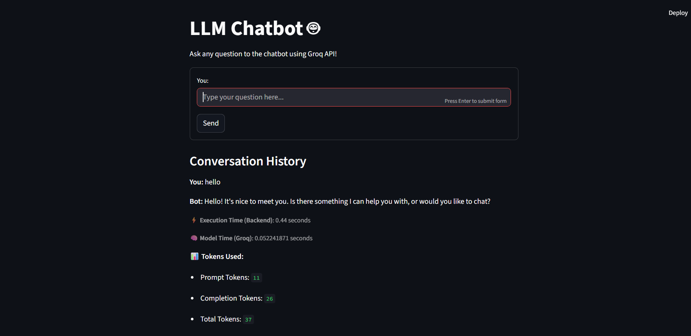

# 🤖 LLM Chatbot – FastAPI + Streamlit

This is a simple chatbot I built using the Groq LLM API. It uses **FastAPI** for the backend and **Streamlit** for the frontend. The idea was to create a lightweight, fully working chatbot that shows the full request/response cycle — including **token usage** and **execution time**.

It’s meant to be easy to run locally or deploy in a Docker container.

---

## 🧠 What It Does

- Takes a user message and sends it to the Groq API (using the `llama3-8b-8192` model)
- Returns the chatbot's reply along with how long it took to process
- Displays **Prompt**, **Completion**, and **Total Token** usage
- Shows **Backend Execution Time** and **Model Time (from Groq API)**
- Keeps the chat history during the session
- Backend logs include all requests and errors for easy debugging

---

## 🚀 Getting Started

### 1. Clone the Repository

```bash
git clone https://github.com/HabibaAhmed526/LLM-Chatbot-Groq-.git
cd llm-chatbot-groq
```

### 2. Set Up a Virtual Environment

```bash
python -m venv .venv
# Activate on Windows
.venv\Scripts\activate
# Activate on Mac/Linux
source .venv/bin/activate

pip install -r requirements.txt
```

### 3. Add Your Groq API Key

Create a file called `.env` inside the `backend/` folder:

```
GROQ_API_KEY=your_groq_api_key_here
```

> You can get a free API key from [Groq Console](https://console.groq.com/keys)

---

### 4. Start the Backend (FastAPI)

```bash
cd backend
uvicorn main:app --reload
```

Your backend will be running at: `http://localhost:8000`

---

### 5. Start the Frontend (Streamlit)

Open a second terminal:

```bash
cd frontend
streamlit run app.py
```

Your chatbot UI will be available at: `http://localhost:8501`

---

## 🐳 Docker Deployment 

If you prefer Docker:

```bash
docker build -t llm-chatbot .
docker run -p 8000:8000 -p 8501:8501 llm-chatbot
```

This will start both the API and frontend inside a Docker container.

---

## 🪵 Logs & Debugging

- Every request and response is logged by the backend
- Token usage and model response time are included in the response


---

## 🧰 Tech Stack

- Python (FastAPI)
- Groq API (`llama3-8b-8192` model)
- Streamlit (Frontend)
- Docker (Deployment)
- Requests, Logging, .env

---

## 📸 Example Screenshot


